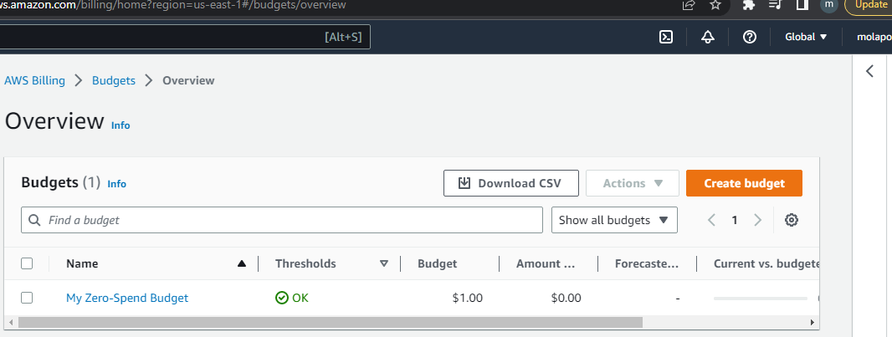
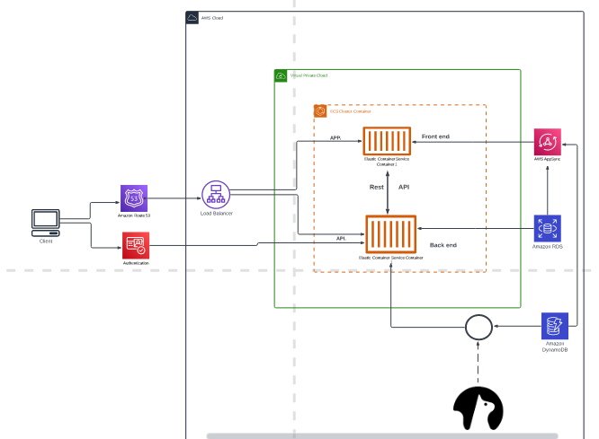
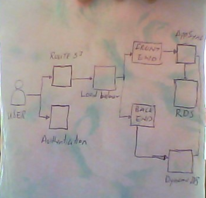

# Week 0 — Billing and Architecture

## Required Homework/Tasks

### Install and verify AWS CLI

I installed the AWS CLI on gitpod, i came across some challenges doing so
it took longer than expected but i eventually got it right

### create a budget

I was able to create a budget, i had issues creating it in my IAM user, i created one in the Root user

### Recreate Logical Architectural Deisgn and Napkin design

I was able to create the Logical Architecture diagraam using Lucid charts as well as on a napkin

[Lucid chart link](https://lucid.app/lucidchart/b90e82f8-923b-4a96-a244-6a51bf77f303/edit?beaconFlowId=F63053CE440DCF77&invitationId=inv_ab6496b7-bef2-43de-ab50-7b8eeba6edfb&page=0_0#)

